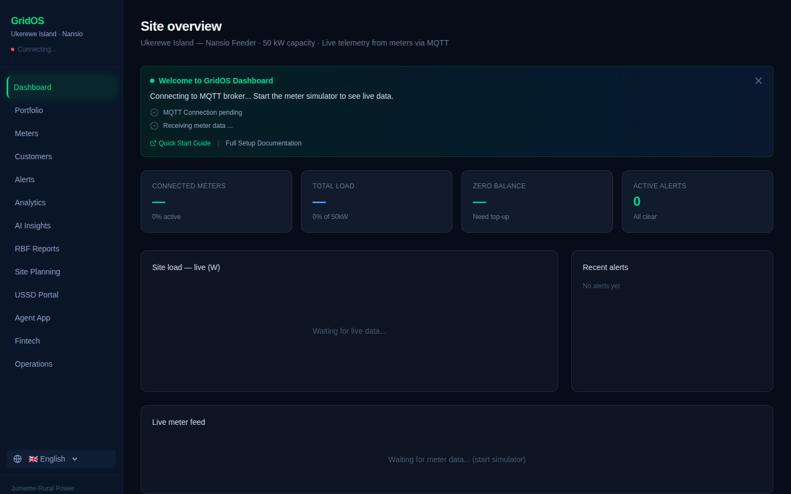

# 🌍 GridOS Dashboard — AI-Powered Mini-Grid Management Platform

**Real-time monitoring and AI-powered analytics for mini-grid operations in East Africa, with multilingual support (English, Swahili, French).**



## Overview
A dashboard for mini-grid operators covering live monitoring, AI-driven analytics, and regulatory reporting.

## ⚠️ Known Issue
This repo's Supabase client references a project ID that does not exist in the organization's Supabase account. Any Supabase-backed feature is currently broken, not degraded — flag this before building on top of it. See `CLAUDE.md`.

## Key Capabilities
- Dashboard: live KPIs, load chart, meter grid, alerts
- Meters: real-time telemetry, customer names, status, balances
- Alerts: severity-tiered live alert stream
- Analytics: revenue tracking
- AI Insights: load forecasting, site-health digital twin, credit scoring, time-of-use pricing
- RBF Reports: draft templates modeled on REA Tanzania/World Bank/EWURA formats — **not verified against the actual agencies' current submission requirements**
- Site Planning: geospatial analysis via WorldPop & Global Solar Atlas
- MQTT integration for live streaming (HiveMQ), with a built-in local simulator for testing without MQTT

## Technology Stack

| Layer | Technology |
|---|---|
| Frontend | React, Vite |
| Real-time | MQTT (HiveMQ) |
| Backend | Supabase client (currently pointing to a nonexistent project) |

## Getting Started
```bash
npm i
npm run dev
```
The built-in simulator lets you run and test without a live MQTT connection.

## Project Status
Substantial feature set built out; backend connection is currently broken and needs to be resolved or reconfigured before this can be considered functional end-to-end.

## Roadmap
- [ ] Reconnect to a real Supabase project or migrate to an environment-variable-based config
- [ ] Verify RBF report formats against the actual REA Tanzania/World Bank/EWURA current requirements before external use

## Contributing
See the [org-wide CONTRIBUTING.md](https://github.com/creova-gif/.github/blob/main/CONTRIBUTING.md).

## License
Proprietary — © CREOVA. All rights reserved.

## Author / Organization
Built by [Justin Mafie](https://github.com/creova-gif) under CREOVA.

## Documentation
See `CLAUDE.md` for the specific broken-backend flag.
